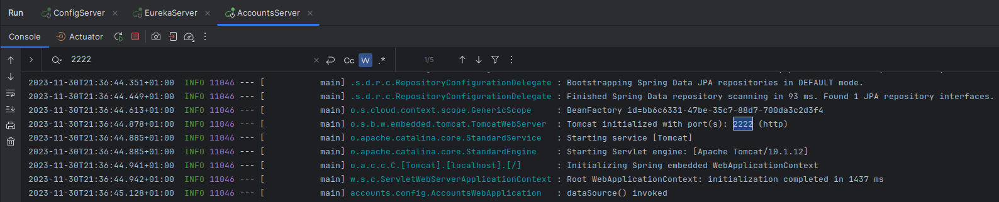
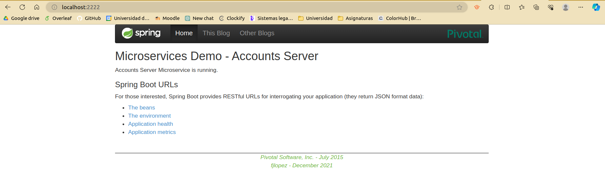
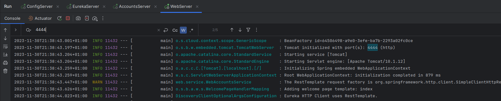
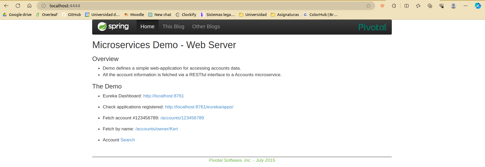
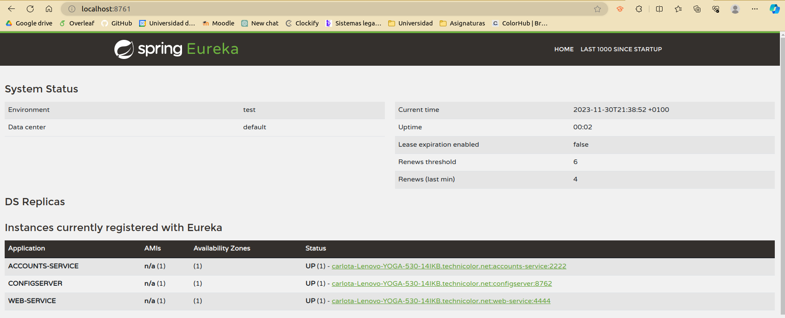
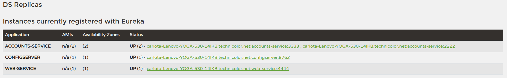
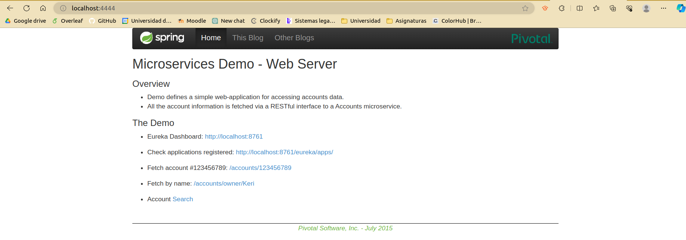
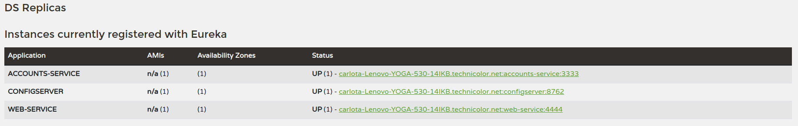

# Lab 6 - Microservices

## Task to do:

### 1. Create configuration repository and update service configuration
The repository is located at https://github.com/carlotaquintana/lab6-microservices-config-repo and the configuration of the service `config` 
it`s in this repository.

### 2. Run two services and capture logs
The image provided shows the logs of the two services running, which are `accounts (2222)` and `web`.

### 3. Check service registration on Eureka dashboard
Screenshot of the Eureka dashboard to ensure proper registration of the `accounts` and `web` services.

### 4. Update configuration repository
The configuration repository has been updated so that the `accounts` service uses the port 3333.

https://github.com/carlotaquintana/lab6-microservices-config-repo/commit/3f2885deae0e3bf5ab2626ffe4513b9bcee1a845

### 5. Run a second instance of the `accounts` service
When running a second instance of the `accounts` service, the Eureka dashboard shows that the service is registered twice.

#### What happens? 
The service is registered twice because it is running on two different ports. The first instance is running on port 2222 and the second instance is running on port 3333.

### 6. Kill the service `accounts (2222)` and do requests to `web`
When the service `accounts (2222)` is killed and requests are made to `web`, the Eureka dashboard shows that the service is still registered.
What happens is that the service is still registered because it is still running on port 3333.
That is because the service is registered twice, so when one of the instances is killed, the other one is still running.

### 7. Can the web service provide information about the accounts again?
The web service can provide information about the accounts again because the service is still registered on port 3333.

#### Why? 
Because the service is registered twice, so when one of the instances is killed, the other one is still running.

